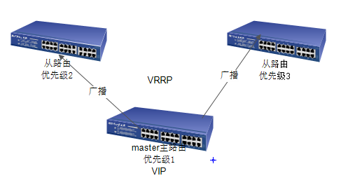
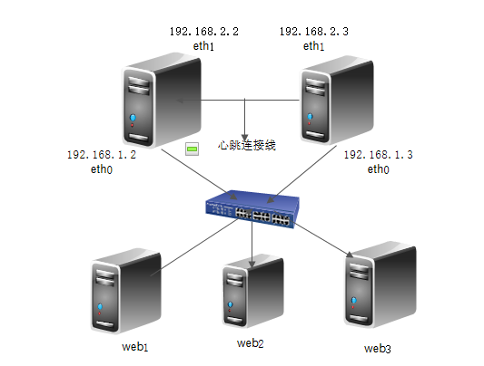

<!-- more -->

## 在线教程

- [Nginx开发从入门到精通](http://tengine.taobao.org/book/)

## Nginx+Keepalived实现高可用Web Server

### [Keepalived](https://www.keepalived.org/)介绍

是一个免费开源的，用C编写的类似于layer3, 4 & 7交换机制软件，具备我们平时说的第3层、第4层和第7层交换机的功能。主要提供loadbalancing（负载均衡）和 high-availability（高可用）功能，负载均衡实现需要依赖Linux的虚拟服务内核模块（ipvs），而高可用是通过VRRP协议实现多台机器之间的故障转移服务。

Keepalived软件起初是专门为LVS负载均衡软件设计的用来管理并监控LVS集群系统中各个服务节点的状态，后来又加入了可以实现高可用的VRRP功能。因此，Keepalived除了能够管理LVS软件外，还可以作为其他服务的高可用解决方案软件。

Keepalived软件主要是通过VRRP协议实现高可用功能的,VRRP出现的目的就是为了解决静态路由单点故障问题的。

### [VRRP](https://baike.baidu.com/item/%E8%99%9A%E6%8B%9F%E8%B7%AF%E7%94%B1%E5%99%A8%E5%86%97%E4%BD%99%E5%8D%8F%E8%AE%AE)原理

VRRP(Virtual Router Redundancy Protocol)虚拟路由器冗余协议

 

1.master在工作状态会不断群发一个广播包(内涵优先参数)

2.其他路由收到收到广播后会和自己的优先参数作对比,如果优先参数小于自己则什么都不执行,如果优先参数大于自己则开启争抢机制

3.如果启动了争抢机制,他就会群发自己的优先参数,最终优先参数最小的称为master路由.

### Keepalived的三个核心模块

* core核心模块
* check健康监测
* vrrp虚拟路由冗余协议

### Keepalived服务的三个重要功能

* 管理LVS
* 对LVS集群节点检查
* 作为系统网络服务的高可用功能

### Keepalived高可用故障切换转移原理

在Keepalived服务正常工作时，主Master节点会不断地向备节点发送（多播的方式）心跳消息，用以告诉备Backup节点自己还活着，当主Master节点发生故障时，就无法发送心跳消息，备节点无法检测到来自主Master节点心跳了，于是调用自身的接管程序，接管主Master节点的IP资源及服务。而当主Master节点恢复时，备Backup节点又会释放主节点故障时自身接管的IP资源及服务，恢复到原来的备用角色。
 

### Keepalived安装

#### YUM安装

```bash
yum install keepalived
```

#### 编辑主机配置文件

::: tip
配置文件中virtual_ipaddress需替换成局域网段内不冲突的IP,主备VIP(虚IP)相同  
VIP后添加 /24 dev (网卡名)
:::

```bash
vi /etc/keepalived/keepalived.conf
```

```bash
! Configuration File for keepalived

global_defs {
}

vrrp_script check_nginx {
    script "/usr/local/keepalived/shell/check_nginx.sh"
    interval 2
    weight -20
}

vrrp_instance VI_1 {
    state MASTER
    interface eth0
    virtual_router_id 51
    priority 100
    advert_int 1
    authentication {
        auth_type PASS
        auth_pass 1111
    }
    virtual_ipaddress {
        10.211.55.100/24 dev eth0
    }
    track_script {
        check_nginx
    }
}
```

#### 编辑备机配置文件

::: tip
配置文件中virtual_ipaddress需替换成局域网段内不冲突的IP,主备VIP(虚IP)相同  
VIP后添加 /24 dev (网卡名)  
备机priority > 主机priority + weight
:::

```bash
vi /etc/keepalived/keepalived.conf
```

```bash
! Configuration File for keepalived

global_defs {
}

vrrp_script check_nginx {
    script "/usr/local/keepalived/shell/check_nginx.sh"
    interval 2
    weight -20
}

vrrp_instance VI_1 {
    state BACKUP
    interface eth0
    virtual_router_id 51
    priority 90
    advert_int 1
    authentication {
        auth_type PASS
        auth_pass 1111
    }
    virtual_ipaddress {
        10.211.55.100/24 dev eth0
    }
    track_script {
        check_nginx
    }
}
```

#### 分别在主备机编写检测脚本并赋权

```bash
vi /usr/local/keepalived/shell/check_nginx.sh
```

```bash
#!/bin/bash
count=`ps -C nginx --no-header | wc -l`
if (( $count > 1 )); then
    exit 0
else
    exit 1
fi
```

```bash
chmod +x /etc/keepalived/check_nginx.sh
```

#### 配置Keepalived日志独立记录文件

默认Keepalived日志记录在系统日志中/var/log/messages,不方便查看。
 
```bash
vi /etc/sysconfig/keepalived
```

选项修改如下:

```bash
KEEPALIVED_OPTIONS="-D -d -S 0"
```

```bash
vi /etc/rsyslog.conf
```

增加以下2行:

```bash
#keepalived
local0.*                                               /var/log/keepalived.log
```

重启日志同步服务

```bash
service rsyslog restart
```

#### 启动Nginx及Keepalived

```bash
/usr/local/nginx/sbin/nginx
service keepalived start
```

### VIP漂移验证

正常情况下VIP绑定在主机网卡，主机上运行:

```bash
ip addr|grep 10.211.55.100
```

主机能够看到如下信息，而备机上没有

```bash
    inet 10.211.55.100/24 brd 10.211.55.255 scope global secondary noprefixroute eth0
```

模拟异常，以下操作都可以
* 关闭主机
* 主机断网 (service network stop)
* 关闭主机Keepalived (service keepalived stop)
* 关闭主机Nginx (/usr/local/nginx/sbin/nginx -s stop)

VIP自动漂移，备机能够看到如下信息，而主机上没有

```bash
    inet 10.211.55.100/24 brd 10.211.55.255 scope global secondary noprefixroute eth0
```

通过虚IP访问URL时，也可以看到流量进入的备机Nginx  
模拟异常后，手动恢复主机系统、网络及Keepalived和Nginx后，VIP重新漂移回主机

::: tip
模拟异常时，前3种(关机、断网、关闭主机Keepalived)VIP能实时漂移，关闭主机Nginx操作漂移时长取决于监控脚本的运行间隔(主机配置文件中的interval字段)
:::

### VIP漂移条件分析

* 主机Keepalived服务不具备条件向备机及时发送心跳(断网、宕机等)
* 由于健康检查脚本执行结果不为0，造成主机权值下降(priority = priority + weight)，且低于备机priority

### 集群整体可用条件

::: tip
备机可以有多台，数量越多集群整体可用性越高
:::

* 包含主机或者所有备机在内，只要其中有一台服务器上的Keepalived+Nginx都是可用的，则集群整体可用

### 使用场景扩展

* 除Nginx高可用外，还可用于其他场景，如Redis、MySQL、其他WebServer，或者自己开发的网络服务
* 针对Nginx场景，上述流程仅监测Nginx进程状态，大家可自定义健康检查脚本，结合curl等命令可进行URL级别的健康检查

### 扩展阅读

* [Keepalived官网](https://www.keepalived.org/)
* [Keepalived官方文档](https://www.keepalived.org/doc/index.html)
